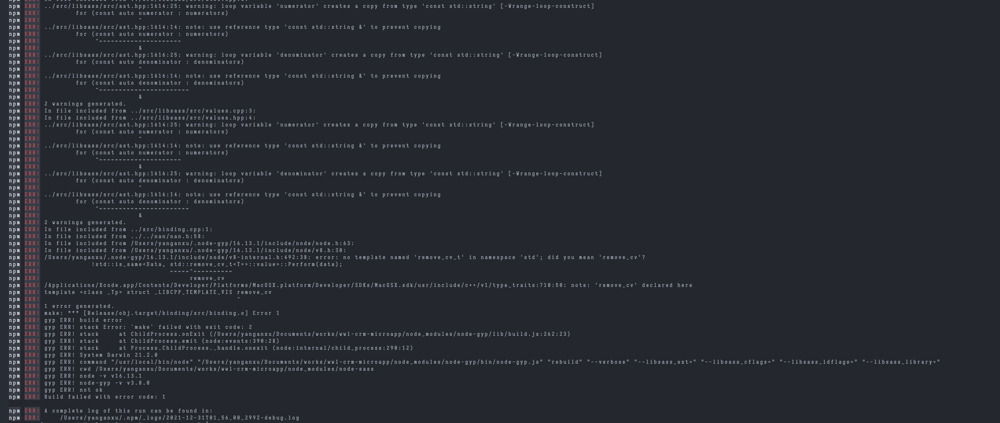

## 小程序踩坑&&记录

此文档仅记录taro+ts+react的钉钉小程序的踩坑记录

- taro日期选择框Picker 钉钉端存在选择器颗粒度的问题，原因：官方bug，目前已有issue:
 [#9350](https://github.com/NervJS/taro/issues/9350)
- taro设置flex布局时子元素将不适用position:absulute布局,定位父级元素将出现高度问题，如需定位确保父元素没有flex属性即可
- 在ios和android之间原生列表的渲染可能会出现string || number类型判断的错误而导致渲染失败的，常会出现在switch 的case语句中，解决方案是类型强制转换=>Number(str.toSting())或其他方式也可（ios会默认转换为number，但android不会）
- 
  

| 未解决
  
- 父子组件结构出现父组件tab切换点击不顺畅的情况发生，目前看来说代码逻辑没问题，且无法在模拟器及开发环境上复现，只能从真机上复现，代码地址暂未粘贴
- 小程序端less添加scss安装失败
    
    目前原因正在排查